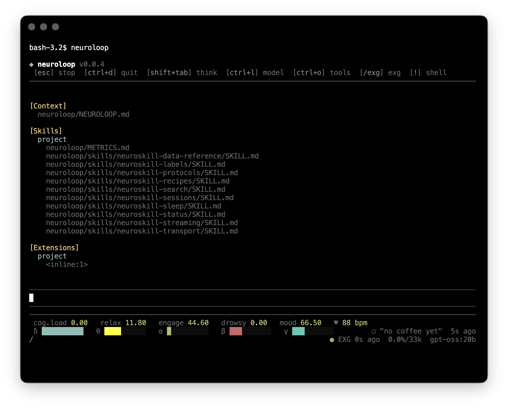

# NeuroLoop

**NeuroLoop** is an BCI-aware AI coding and life companion powered by a real-time consumer BCI device. It reads brainwaves and physiology continuously and uses that live biometric data to inform every response — adapting its tone, offering guided protocols, and labelling meaningful mental states as they happen.

NeuroLoop™ runs on top of the [pi coding agent](https://github.com/mariozechner/pi-coding-agent) framework and communicates with the [NeuroSkill™](https://neuroskill.com) State of Mind BCI server, which exposes a local WebSocket API for real-time neural data.

[Paper](https://arxiv.org/abs/2603.03212)



---

## Features

- 🧠 **Live EXG context** — injects a real-time snapshot of brain state (focus, relaxation, engagement, drowsiness, HRV, sleep stage, consciousness indices, etc.) into every LLM turn
- 📡 **Live TUI panel** — real-time scores and EEG band bars stream directly into the terminal footer via WebSocket; no polling delay
- 🎯 **Contextual skill loading** — detects domain signals in each user message (stress, sleep, focus, grief, awe, philosophy, HRV, etc.) and runs the matching NeuroSkill™ commands in parallel before the LLM responds
- 🏃 **Guided protocols** — 100+ mind-body practices (breathing, meditation, somatic work, sleep, music, social-media, dietary, gym, eye exercises, etc.) proposed intelligently and executed step-by-step with OS notifications and EXG labelling
- 🏷️ **Auto-labelling** — silently annotates notable mental, emotional, and philosophical moments as timestamped EXG events; the label text and context are written by the LLM
- 💾 **Persistent memory** — reads and writes a long-term memory file (`~/.neuroskill/memory.md`) across sessions
- 🔍 **Prewarm cache** — kicks off expensive `neuroskill compare` runs proactively in the background so results are ready when needed
- 🌐 **Web tools** — `web_fetch` and `web_search` available to the agent
- 📅 **Daily calibration nudge** — reminds the user to run a calibration sequence at most once every 24 hours
- 🔑 **In-app API key management** — add, list, or remove provider API keys at runtime with `/key` (no file editing required); keys are stored securely in `~/.neuroloop/auth.json`
- 🤖 **Multi-provider model support** — Anthropic, OpenAI, Gemini, and all Ollama models (including `gpt-oss:20b` as the default local model)

---

## Quick Start

```bash
npx neuroloop
```

Requires Node.js ≥ 20. The NeuroSkill™ EXG server must be running and a Muse device connected for live biometric features.

---

## How It Works

On every user message the harness:

1. Runs `neuroskill status` via WebSocket and injects the live EXG snapshot into a visible chat bubble and the LLM system prompt
2. Detects domain signals in the user's prompt (30+ categories: stress, sleep, focus, grief, awe, morals, symbiosis, HRV, somatic, consciousness, identity, etc.)
3. Runs the matching NeuroSkill™ commands in parallel — session metrics, label searches, sleep staging, compare cache — and appends results to the system context
4. If protocol intent is detected, injects the full protocol repertoire (`skills/neuroskill-protocols/SKILL.md`) on demand
5. Injects the capability index (`NEUROLOOP.md`) and any persistent agent memory so the LLM always has full context

The LLM receives the live EXG data, behavioural guidance, and domain-specific history. The user sees only the EXG snapshot bubble.

---

## TUI

NeuroLoop extends the pi TUI with:

- **Custom header** — brand logo (`◆ neuroloop vX.Y.Z`) and keybinding hints
- **Live footer metrics** — real-time scores row (`focus`, `cog.load`, `relax`, `engage`, `drowsy`, `mood`, `♥ bpm`) and EEG band bars (`δ θ α β γ`) updated via WebSocket; the most recent EXG label and its timestamp are shown right-aligned
- **Status bar** — EXG connection dot (`◉` / `◌`), "last updated" age, context usage, and current model

### Slash Commands

| Command | Description |
|---|---|
| `/key` | Interactive: choose a provider, paste your API key → saved to `~/.neuroloop/auth.json` |
| `/key list` | Show all supported providers and which ones are currently configured |
| `/key remove` | Interactive: pick a stored key to delete |
| `/key remove <id>` | Directly remove a specific provider key (e.g. `/key remove google`) |
| `/exg` | Show a full EXG snapshot in the chat |
| `/exg on` | Re-enable the live EXG panel and reconnect WebSocket |
| `/exg off` | Disable the live EXG panel and disconnect WebSocket |
| `/exg <seconds>` | Change the status poll interval (e.g. `/exg 0.5`) |
| `/exg port <n>` | Connect to the NeuroSkill™ server on a different port |
| `/neuro <cmd> [args…]` | Run any neuroskill subcommand directly (output shown in chat) |

### Keyboard Shortcuts

| Shortcut | Action |
|---|---|
| `ctrl+shift+e` | Show live EXG snapshot in chat |

---

## Tools

| Tool | Description |
|---|---|
| `neuroskill_run` | Run any neuroskill subcommand (`status`, `session`, `sessions`, `sleep`, `search-labels`, `interactive`, `label`, `search`, `compare`, `umap`, `listen`, `notify`, `calibrate`, `raw`, …) |
| `neuroskill_label` | Create a timestamped EXG annotation for a notable mental/emotional/somatic moment |
| `run_protocol` | Execute a multi-step guided protocol with OS notifications, step timing, and per-step EXG labelling |
| `prewarm` | Kick off a background `neuroskill compare` run so the result is ready when needed |
| `memory_read` | Read the agent's persistent memory file (`~/.neuroskill/memory.md`) |
| `memory_write` | Write or append to the persistent memory file |
| `web_fetch` | Fetch the content of a URL |
| `web_search` | Search the web |

---

## Skills

The following skill files are loaded from `skills/` and made available to the LLM for contextual injection:

| Skill | Description |
|---|---|
| `neuroskill-status` | `status` command — full device/session/scores snapshot |
| `neuroskill-sessions` | `session` and `sessions` commands — per-session metrics and session history |
| `neuroskill-sleep` | `sleep` and `umap` commands — sleep staging and UMAP visualisation |
| `neuroskill-labels` | `label`, `search-labels`, `interactive` commands — EXG annotations and semantic search |
| `neuroskill-search` | `search` and `compare` commands — ANN similarity search and session comparison |
| `neuroskill-streaming` | `listen`, `notify`, `calibrate`, `timer`, `raw` — real-time events and notifications |
| `neuroskill-transport` | WebSocket and HTTP transport, port discovery, output modes, global flags |
| `neuroskill-protocols` | 100+ guided protocols organised by EXG signal — loaded on-demand |
| `neuroskill-data-reference` | All metric fields, value ranges, and their meaning |
| `neuroskill-recipes` | Shell and scripting recipes for automation and pipelines |
| `neuroskill-metrics` | Full scientific reference for all EXG indices (`METRICS.md`) |

---

## EXG Metrics

NeuroLoop exposes 40+ neuroscientific metrics derived from the Muse headset, including:

- EEG band powers (δ, θ, α, β, γ) at TP9, AF7, AF8, TP10
- Ratios and indices: TAR, BAR, TBR, DTR, PSE, APF, BPS, SNR, Coherence, PAC, FAA
- Complexity measures: Permutation Entropy, Higuchi FD, DFA Exponent, Sample Entropy
- Composite scores: Focus, Relaxation, Engagement, Meditation, Cognitive Load, Drowsiness
- Consciousness metrics: LZC, Wakefulness, Information Integration
- PPG / HRV: Heart Rate, RMSSD, SDNN, pNN50, LF/HF Ratio, SpO₂, Baevsky Stress Index
- Sleep staging: Wake / N1 / N2 / N3 / REM
- Extended indices: Depression, Anxiety, Bipolar, ADHD, Headache, Migraine, Narcolepsy, Insomnia, Epilepsy risk, Mu Suppression

> ⚠️ **Research Use Only.** All metrics are experimental outputs from consumer-grade EXG hardware. They are not validated clinical measurements, not FDA/CE-cleared, and must not be used for diagnosis or treatment.

See [`METRICS.md`](METRICS.md) for the full scientific reference for every metric.

---

## Repository Structure

```
neuroloop/
├── src/
│   ├── main.ts               # Entry point — session setup, skill loading, model registry
│   ├── neuroloop.ts          # ExtensionFactory — tools, hooks, renderers, TUI, WebSocket
│   ├── memory.ts             # Persistent memory helpers (~/.neuroskill/memory.md)
│   ├── neuroskill/
│   │   ├── index.ts          # Public barrel
│   │   ├── run.ts            # runNeuroSkill() — WebSocket command runner
│   │   ├── signals.ts        # detectSignals() — prompt domain detection
│   │   └── context.ts        # selectContextualData() — parallel data fetching + compare cache
│   └── tools/
│       ├── web-fetch.ts      # web_fetch tool
│       ├── web-search.ts     # web_search tool
│       └── protocol.ts       # run_protocol tool — step-by-step guided protocols
├── skills/                   # Domain skill files (one subdirectory per skill)
├── NEUROLOOP.md              # Capability index injected every turn
├── METRICS.md                # Full neuroscientific reference for all EXG metrics
└── dist/                     # Compiled output (neuroloop.js)
```

Agent data is stored under `~/.neuroloop/` (sessions, auth, settings, models).

---

## Configuration

### API Keys

The quickest way to add an API key is the built-in `/key` command:

```
/key               # interactive provider picker → paste key → done
/key list          # see what is configured
/key remove        # interactive removal
/key remove google # remove a specific provider directly
```

Keys are stored in `~/.neuroloop/auth.json`. Supported providers:

| Provider | ID | Environment variable |
|---|---|---|
| Google Gemini | `google` | `GEMINI_API_KEY` |
| Anthropic (Claude) | `anthropic` | `ANTHROPIC_API_KEY` |
| OpenAI (GPT) | `openai` | `OPENAI_API_KEY` |
| Mistral AI | `mistral` | `MISTRAL_API_KEY` |
| Groq | `groq` | `GROQ_API_KEY` |
| xAI (Grok) | `xai` | `XAI_API_KEY` |
| OpenRouter | `openrouter` | `OPENROUTER_API_KEY` |
| Cerebras | `cerebras` | `CEREBRAS_API_KEY` |

You can also set keys via environment variables or by editing `~/.neuroloop/auth.json` directly:

```json
{
  "google":    { "type": "api_key", "key": "AIza..." },
  "anthropic": { "type": "api_key", "key": "sk-ant-..." },
  "openai":    { "type": "api_key", "key": "sk-..." }
}
```

After adding a key, switch to a model from that provider with `/model` (`Ctrl+L`).

### Models

NeuroLoop supports all pi-compatible providers (Anthropic, OpenAI, Gemini) as well as any locally running Ollama models. `gpt-oss:20b` is always registered as the default Ollama model even when Ollama is unreachable.

Model selection order:
1. Model saved in the current session
2. Default from `~/.neuroloop/settings.json`
3. First built-in provider with a valid API key or OAuth token
4. First available Ollama model (`gpt-oss:20b` when none are listed first)

### NeuroSkill™ Server Port

The agent auto-discovers the NeuroSkill™ server port via `lsof` and falls back to `8375`. You can override the port at runtime with `/exg port <n>`.

---

## How to Cite

If you use NeuroLoop™ in academic work, please cite it as:

```bibtex
@software{neuroloop2026,
  author       = {Nataliya Kosmyna and Eugene Hauptmann},
  title        = {{NeuroLoop™: An EXG-Aware AI Companion Powered by Real-Time Brainwave Analysis}},
  year         = {2026},
  version      = {0.0.7},
  url          = {https://github.com/NeuroSkill-com/neuroloop}
}
```

### Related Work

NeuroLoop™ builds on the following neuroscientific foundations. If you use specific metrics, please also cite the primary literature listed in [`METRICS.md`](METRICS.md). Key upstream works include:

```bibtex
@article{krigolson2017choosing,
  author  = {Krigolson, Olav E. and Williams, Chad C. and Norton, Angela and Hassall, Cameron D. and Colino, Francisco L.},
  title   = {Choosing {MUSE}: Validation of a Low-Cost, Portable {EEG} System for {ERP} Research},
  journal = {Frontiers in Neuroscience},
  volume  = {11},
  pages   = {109},
  year    = {2017},
  doi     = {10.3389/fnins.2017.00109}
}

@inproceedings{cannard2021validating,
  author    = {Cannard, Christian and Wahbeh, Helané and Delorme, Arnaud},
  title     = {Validating the Wearable {MUSE} Headset for {EEG} Spectral Analysis and Frontal Alpha Asymmetry},
  booktitle = {2021 IEEE International Conference on Bioinformatics and Biomedicine (BIBM)},
  year      = {2021},
  doi       = {10.1109/bibm52615.2021.9669778}
}

@article{coan2004frontal,
  author  = {Coan, James A. and Allen, John J. B.},
  title   = {Frontal {EEG} Asymmetry as a Moderator and Mediator of Emotion},
  journal = {Biological Psychology},
  volume  = {67},
  number  = {1--2},
  pages   = {7--50},
  year    = {2004},
  doi     = {10.1016/j.biopsycho.2004.03.002}
}

@article{casali2013theoretically,
  author  = {Casali, Adenauer G. and Gosseries, Olivia and Rosanova, Mario and Boly, Melanie and Sarasso, Simone and Casali, Karina R. and Casarotto, Silvia and Bruno, Marie-Aurélie and Laureys, Steven and Tononi, Giulio and Massimini, Marcello},
  title   = {A Theoretically Based Index of Consciousness Independent of Sensory Processing and Behavior},
  journal = {Science Translational Medicine},
  volume  = {5},
  number  = {198},
  pages   = {198ra105},
  year    = {2013},
  doi     = {10.1126/scitranslmed.3006294}
}

@article{klimesch1999eeg,
  author  = {Klimesch, Wolfgang},
  title   = {{EEG} Alpha and Theta Oscillations Reflect Cognitive and Memory Performance: A Review and Analysis},
  journal = {Brain Research Reviews},
  volume  = {29},
  number  = {2--3},
  pages   = {169--195},
  year    = {1999},
  doi     = {10.1016/s0165-0173(98)00056-3}
}

@article{donoghue2020parameterizing,
  author  = {Donoghue, Thomas and Haller, Matar and Peterson, Erik J. and Varma, Paroma and Sebastian, Priyadarshini and Gao, Richard and Noto, Torben and Lara, Antonio H. and Wallis, Jonathan D. and Knight, Robert T. and Bhatt, Parveen and Voytek, Bradley},
  title   = {Parameterizing Neural Power Spectra into Periodic and Aperiodic Components},
  journal = {Nature Neuroscience},
  volume  = {23},
  pages   = {1655--1665},
  year    = {2020},
  doi     = {10.1038/s41593-020-00744-x}
}

@article{pope1995biocybernetic,
  author  = {Pope, Alan T. and Bogart, Edward H. and Bartolome, Debbie S.},
  title   = {Biocybernetic System Evaluates Indices of Operator Engagement in Automated Task},
  journal = {Biological Psychology},
  volume  = {40},
  number  = {1--2},
  pages   = {187--195},
  year    = {1995},
  doi     = {10.1016/0301-0511(95)05116-3}
}

@article{bandt2002permutation,
  author  = {Bandt, Christoph and Pompe, Bernd},
  title   = {Permutation Entropy: A Natural Complexity Measure for Time Series},
  journal = {Physical Review Letters},
  volume  = {88},
  number  = {17},
  pages   = {174102},
  year    = {2002},
  doi     = {10.1103/PhysRevLett.88.174102}
}

@article{tononi2004information,
  author  = {Tononi, Giulio},
  title   = {An Information Integration Theory of Consciousness},
  journal = {BMC Neuroscience},
  volume  = {5},
  pages   = {42},
  year    = {2004},
  doi     = {10.1186/1471-2202-5-42}
}
```

---

## License

GPLv3
